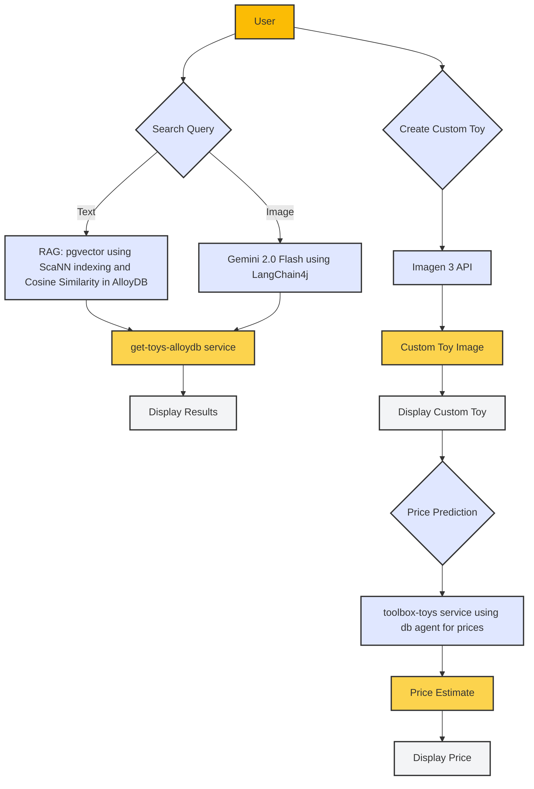

# Toy Store Search App

# Architecture



---

### AlloyDB
In this Lab we are using PostgreSQL-compatible database. It is used to hold the toystore data and supports vectors.

### Cloud Functions (Cloud Run Gen2)
We are using cloud run functions. They are two services.

1. get-toys-alloydb - It is microservice used to communicate with alloydb cluster.
2. toolbox-toys - It is the microservice used to predict the price of the custom created toy by employing the Vector Search matches approach.

# Instructions to deploy

# Prerequisites

# Enable APIs

```bash
gcloud services enable  alloydb.googleapis.com \
  compute.googleapis.com \
  cloudresourcemanager.googleapis.com \
  servicenetworking.googleapis.com \
  run.googleapis.com \
  cloudbuild.googleapis.com \
  cloudfunctions.googleapis.com \
  aiplatform.googleapis.com
```

Create a cluster and instance
Navigate the AlloyDB page in the Cloud Console. Click on CREATE CLUSTER from that page:


You'll see a screen like the one below. Create a cluster and instance with the following values (Make sure the values match in case you are cloning the application code from the repo):
```
cluster id: vector-cluster
password: alloydb
PostgreSQL 15 compatible
Region: us-central1
Networking: default
instance id: vector-instance
```


When you select the default network, you'll see a screen like the one below.
Select SET UP CONNECTION.


Select "<b>Use an automatically allocated IP range</b>" and Continue. After reviewing the information, select <b>CREATE CONNECTION</b>.


Once your network is set up, you can continue to create your cluster. 
Click <b>CREATE CLUSTER</b> to complete setting up of the cluster.
Note: Cluster creation will take around 10 minutes. Once it is successful, you should see a screen that shows the overview of your cluster you just created.

# 1. Install PostgreSQL Client on the VM
Log in to the VM and install the psql client. Here's how to do that:

```bash
sudo apt update
sudo apt install postgresql-client
```
This installs the PostgreSQL client required to interact with the database.

# 2. Retrieve the Cluster Connection Details
Run the following command to get the IP address of your AlloyDB primary instance:

```bash
export PRIMARY_IP=$(gcloud alloydb instances describe my-cluster-primary  --region=us-central1  --format="value(ipAddresses.ipAddress)")
```

# 3. Connect to the Database
Use the psql client from your VM to connect to the database:

```bash
psql -h $PRIMARY_IP -U postgres -d postgres
```

When prompted, enter the password you specified during the database setup.

#4. Enable Firewall Rules (If Needed)
Ensure that the database IP is accessible by creating a firewall rule for the VM to communicate with the database:

```bash
gcloud compute firewall-rules create allow-alloydb-access \
    --network=default \
    --allow=tcp:5432 \
    --source-ranges=$PRIMARY_IP/32
```

### 1. CREATE Script

```sql
CREATE TABLE toys (
  id VARCHAR(25),
  name VARCHAR(25),
  description VARCHAR(20000),
  quantity INT,
  price FLOAT,
  image_url VARCHAR(200),
  text_embeddings vector(768)
) ;
````
### 2. Enable Extensions

```sql
CREATE EXTENSION vector;
CREATE EXTENSION google_ml_integration;
GRANT EXECUTE ON FUNCTION embedding TO postgres;
```
### SCANN Indexing (Optional):
```sql
CREATE EXTENSION IF NOT EXISTS alloydb_scann;
Create Index (ScaNN):
CREATE INDEX toysearch_index ON toys
USING scann (text_embeddings cosine)
WITH (num_leaves=9);
```

### 3. INSERT Script

Insert script in data.sql

### 4. Grant Vertex AI User ROLE to the AlloyDB service account

In the cloud terminal, Enter the following commands

```bash
PROJECT_ID=$(gcloud config get-value project)

gcloud projects add-iam-policy-binding $PROJECT_ID \
  --member="serviceAccount:service-$(gcloud projects describe $PROJECT_ID --format="value(projectNumber)")@gcp-sa-alloydb.iam.gserviceaccount.com" \
  --role="roles/aiplatform.user"
```

### 6. Update Text Embeddings

```sql
UPDATE toys set text_embeddings = embedding('text-embedding-005', description);
```

### 7. Vector Search (RAG)

At this point you are ready to test your Nearest Neighbor query results using the embeddings just created from AlloyDB Studio.
For detailed steps on how to create ScaNN index, refer to this blog: 

```sql
select * from toys
ORDER BY text_embeddings <=> CAST(embedding('text-embedding-005', 'white plush teddy bear toy with floral pattern') as vector(768))
LIMIT 5;
```

### tools.yaml 
This file (in this repo inside the toolbox folder) contains the tool implementation for this project to predict the price of the custom created toy by employing the Vector Search matches approach.


At the time of implementation, change the toolbox query to:
select avg(price) from (
  SELECT price FROM toys
      ORDER BY text_embeddings <=> CAST(embedding('text-embedding-005', 'elephant toys') AS vector(768))
      LIMIT 5
) as price  

---

change the user, password, db_name in your Cloud Run Function application code (in the "get-toys-alloydb" Cloud Run Function) according to what you set in this setup step.


## Build and Deploy
From your Cloud Shell Terminal, run the following commands:

  git clone https://github.com/AbiramiSukumaran/toysearch

Make sure to create the 2 Cloud Run Functions we are using in this project. The source code for those 2 are available in the folders get-toys-alloydb and toolbox-toys respectively. Once you create the Cloud Run Functions, delete these folders from your web app folder structure. 

  
  #### cd toysearch
  

  #### export PROJECT_ID YOUR_PROJECT_ID
  
  #### export GOOGLE_API_KEY YOUR_KEY
  

  #### mvn package
  
  #### mvn spring-boot:run
  
  
You should be able to run your app in your local cloud shell machine. 

## Serverless Deployment

#### gcloud run deploy --source .

Provide the necessary details as prompted and you should be able to get the app deployed serverlessly on Cloud Run.

